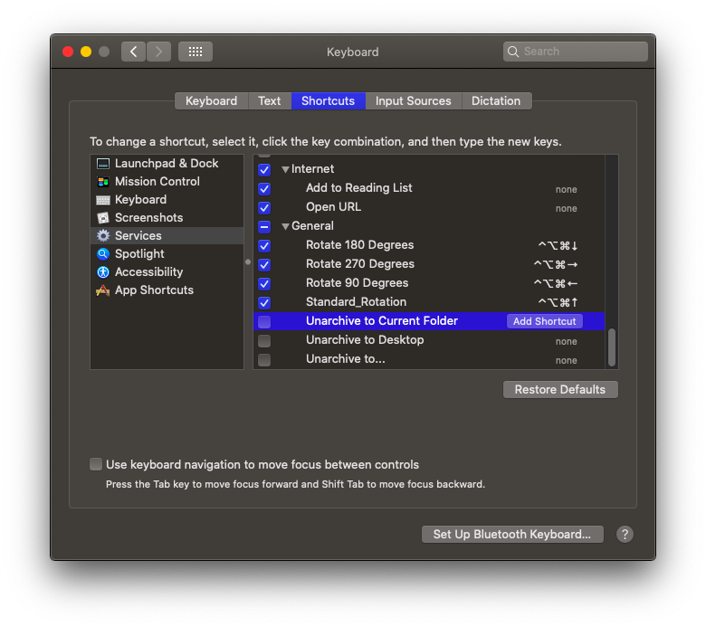

# Display Rotation

MacOS does not provide a facility to rotate your display outside of System Preferences. To work around this, we'll use a display rotation helper.

## Install the Display Rotation Helper

First download the latest version of DisplayRotation.

[Download DisplayRotation @ Github](https://github.com/fewtarius/displayrotation)

1. Copy the Rotation folder to /Applications.
2. Double click each of the services and import them into Automator.
3. Open System Preferences/Keyboard/Shortcuts/Services
4. Configure the following service shortcuts:
   * **Standard Rotation:** Command+Option+Control+Up Arrow
   * **Rotate 90 Degrees:** Command+Option+Control+Left Arrow
   * **Rotate 180 Degrees:** Command+Option+Control+Down Arrow
   * **Rotate 270 Degrees:** Command+Option+Control+Right Arrow
5. Open each application with right-click + Open beginning with Standard Rotation.  If you get stuck, use the standard rotation shortcut to reset the display orientation.

## Changing Display Orientation

Use the keyboard shortcuts or application wrappers to change orientation of your display.

