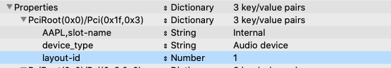

# Configuring your Audio Device

Audio devices are much simpler to configure than they used to be thanks to the development of AppleALC. AppleALC is a kernel extension that provides native Apple audio capabilites. To use it, the first thing you will need to know is what audio codec your laptop uses. If you don't already know, or if you're unsure, you can use a Linux live USB to do a codec dump. A codec dump provides a treasure trove of information about your device and the paths it uses to connect things like internal amplifiers to speakers or headphones.

## Creating a Codec Dump

If you do need a codec dump for whatever reason, boot from your Linux live USB and find the nearest terminal or command line. The following command will display the details of your codec on screen with a pause so you can read it.

```text
# cat /proc/asound/card0/codec#0 | less
```

The first line should provide your codec. It will look something like this:

```text
Codec: Realtek ALC294
```

If you would like to save the codec to a file so you can reference it again when you're back in macOS, cat it to a file instead and save the file to the boot partition of the USB drive, on another USB drive, or somewhere on your network.

```text
# cat /proc/asound/card0/codec#0 > /mnt/MyOtherUSBDrive/codec.txt
```

Now that you're familiar with your codec, let's install AppleALC.

## AppleALC Prerequisites

If you're dual booting with Windows or Linux, you should enable the Devices/Audio/ResetHDA property which will reset the audio device on startup to flush any configuration .

## Installing AppleALC

Installing AppleALC is simple. You just need to download the AppleALC kext from the project's release page and add the kext to C/k/O. You can find it here.

[Download AppleALC @ Github](https://github.com/acidanthera/AppleALC)

Your new AppleALC kext path should look like it does in the tree below.

```text
EFI
└── CLOVER
    └── kexts
        └── Other
            └── AppleALC.kext
```

Before rebooting, let's configure it!

## Configuring AppleALC

This is where things can get a little tricky, as just about every implementation of the same codec is different. Knowing your codec makes things somewhat easier as you can look it up in the AppleALC WIKI and find all of the layouts that could work with it.

[AppleALC Supported Codecs](https://github.com/acidanthera/AppleALC/wiki/Supported-codecs)

If you don't find your codec listed, you might find that it's just a rebranded version of another so it wouldn't hurt to search for "AppleALC {your codec}".

Once you have a list of layouts, but you don't know which is the right one you can test them one by one. Just configure the layout id in config.plist with your favorite plist editor and reboot. If audio works, congratulations! Otherwise, repeat until you've found it.

Open up your plist editor and the config.plist, then browse to Devices/Properties and set the layout-id parameter to your layout id. It should look something like this.



## None of the Layout IDs Worked!

Well, you still have some options although none of them will be fun. The first option would be to take that codec dump that we made earlier and build a new layout for your device, or you could try using VoodooHDA instead. Let's talk about both options.

### Creating a New Layout for AppleALC

This nets the best benefit for you and for everyone else because you'll end up with native support and others with the same device can use it too. It's the most difficult option though. Here's some documentation to help get you started.

[HDA Fix - HaC Mini Hackintosh - by osy](https://osy.gitbook.io/hac-mini-guide/details/hda-fix) \(Great guide on how to make your own HDA patches\)

[AppleALC: Adding Codec Support](https://github.com/acidanthera/AppleALC/wiki/Adding-codec-support)

### Using VoodooHDA

VoodooHDA is an alternative to AppleALC, and it works pretty well but rather than adding native support, VoodooHDA provides its own audio solution. Installing it is pretty straightforward. Simply download the kext, preference pane, and settings loader and add them to your system. The kext goes in C/k/O, if you have AppleALC installed you'll want to remove it. Open \(execute\) the preferences pane and it should prompt you to install, if it doesn't drag it onto System Preferences and it'll install that way. The settings loader should be installed to Applications, and you should run it once to enable it. They can be downloaded here.

[Download VoodooHDA @ SourceForge](https://sourceforge.net/projects/voodoohda/)

As with AppleALC, it should follow the same pattern in the tree.

```text
EFI
└── CLOVER
    └── kexts
        └── Other
            └── VoodooHDA.kext
```

