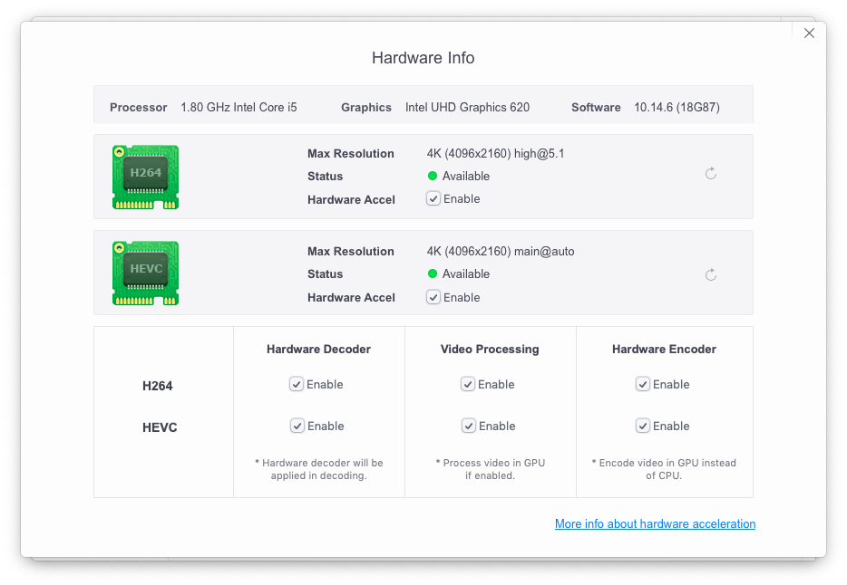

# Display Configuration

Configuring a laptop's integrated GPU is a lot like configuring a desktop's integrated GPU. You usually start by disabling the dedicated GPU if you have one. This section will talk about the methods that you would use for each component of GPU configuration and how to test that it's working, but there are better guides that already exist to help with the heavy lifting.

## Configuring your Display Adapter \(GPU\)

Depending on your laptop, you may have very little to do to configure your iGPU, or you could have to add an elaborate set of patches to configure stuff like DVMT. The most important thing you'll want here is the WhateverGreen kext and it's dependency, LILU. Lilu is a patching mechanism that's used by multiple kernel extensions, and WhateverGreen is responsible for patching your display adapter\(s\).

If you haven't already added WhateverGreen to your CLOVER EFI, better do that now before continuing. You can get it here.

[Download WhateverGreen](https://github.com/acidanthera/WhateverGreen/releases)

### First things first, disable that dGPU!

There are two ways to disable a dGPU in a laptop, the short way and the not so short way. We'll start with the short way because it is really simple. If you don't have a dGPU \(NVidia/ATI dedicated graphics\) you can skip this part and jump straight to configuring your display adapter instead.

To disable your dGPU the short way, add the following to the Boot/Arguments section of your config.plist.

```text
-wegnoegpu
```

This command instructs Whatevergreen to disable all internal and external dedicated GPUs. Don't reboot yet, because we still need to get Whatevergreen!

Mission complete? Great! If it doesn't work out the way you would expect, come back and move on the the not so short method using Hackintosh Slav's wonderful guide.

[How to disable your unsupported GPU for MacOS](https://khronokernel-4.gitbook.io/disable-unsupported-gpus/)

Got it all fixed up? Excellent! Now that this is behind us, it's time to configure your iGPU.

### iGPU Configuration

Apple uses Intel graphics cards that have features other GPUs in Intel's line up don't have. For example, with a Hackintosh laptop it is generally not possible to use DRM as FairPlay 2.0 is not supported. Unfortunately it also means that macOS requires that you patch macOS to believe you have a different GPU than you really do. Since these GPUs fall within the same family, we can use the data provided within the macOS Intel driver to build a patch that enables your GPU with full acceleration.

A prerequisite to configuring your iGPU is knowing which GPU you actually have. If you don't already know, look up your CPU using Intel's Ark utility. Once you find your CPU pay attention to the code name, and the graphics adapter. This information will be useful as you configure your GPU patches.

### iGPU Patching

We can instruct Whatevergreen to patch your GPU by passing specific parameters to macOS in your config.plist. The table below describes the patches that we will be utilizing. These parameters can be found in config.plist under Devices/Properties.

| Key | Function |
| :--- | :--- |
| AAPL,ig-platform-id | This is the platform identifier of the GPU you are spoofing.  \(required\) |
| device-id | This is the device identifier of the GPU you are spoofing. \(required\) |
| framebuffer-patch-enable | This switch enables framebuffer patching.  It is required when setting framebuffer patches such as fbmem and stolenmem. |
| framebuffer-fbmem | This patches framebuffer memory, and is used when you cannot configure DVMT to 64MB in the BIOS.  _Do not use if the DVMT BIOS option is available._ |
| framebuffer-stolenmem | This patches framebuffer stolen memory, and is used when you cannot configure DVMT to 64MB in the BIOS.  _Do not use if the DVMT BIOS option is available._ |

These parameters contain the basics to get you started. If you need more advanced patching to enable your framebuffer, review the [Whatevergreen Intel GPU FAQ](https://github.com/acidanthera/WhateverGreen/blob/master/Manual/FAQ.IntelHD.en.md). The Framebuffer patches are included in the config.plist provided with this guide, however they are disabled. To enable them remove the \# symbol from the beginning of the key.

### iGPU Patches

Now you are ready to configure your patches. Use the table below to select the patch that most closely resembles the configuration from Ark.


`*` Denotes the default configured by Whatevergreen.

`**` Denotes the recommended configuration. These recommendations may or may not work for you. Experiment with different configurations until you find the one that best suits your needs.


### Intel Ivy Bridge

| iGPU | device-id | ig-platform-id | Port Count | Stolen Memory | Framebuffer Memory | Video RAM | Connectors |
| :--- | :--- | :--- | :--- | :--- | :--- | :--- | :--- |
| Intel HD Graphics 4000 | 01660001 | 01006601 | 4 | 96MB | 24MB | 1536MB | LVDS1 HDMI1 DP2 |
| Intel HD Graphics 4000 | 01660002 | 02006601 | 1 | 64MB | 24MB | 1536MB | LVDS1 |
| Intel HD Graphics 4000\* | 01660003 | 03006601 | 4 | 64MB | 16MB | 1536MB | LVDS1 DP3 |
| Intel HD Graphics 4000 | 01660004 | 04006601 | 1 | 32MB | 16MB | 1536MB | LVDS1 |
| Intel HD Graphics 4000 | 01660008 | 08006601 | 3 | 64MB | 16MB | 1536MB | LVDS1 DP2 |
| Intel HD Graphics 4000 | 01660009 | 09006601 | 3 | 64MB | 16MB | 1536MB | LVDS1 DP2 |

#### Usual values

* 01660003 for 1366x768 display laptops
* 01660004 for 1600x900 display laptops or higher
* 01660009 for laptops with eDP internal display

### Intel Haswell

| iGPU | device-id | ig-platform-id | Port Count | Stolen Memory | Framebuffer Memory | Video RAM | Connectors |
| :--- | :--- | :--- | :--- | :--- | :--- | :--- | :--- |
| Intel HD Graphics 4400 | 0a16000c | 0c00160a | 3 | 64MB | 34MB | 1536MB | LVDS1 DP2 |
| Intel HD Graphics 5000\*\* | 0a260005 | 0500260a | 3 | 32MB | 19MB | 1536MB | LVDS1 DP2 |
| Intel HD Graphics 5000 | 0a260006 | 0600260a | 3 | 32MB | 19MB | 1536MB | LVDS1 DP2 |
| Intel Iris Graphics 5100 | 0a2e0008 | 08002e0a | 3 | 64MB | 34MB | 1536MB | LVDS1 DP2 |
| Intel Iris Pro Graphics 5200 | 0d260007 | 0700260d | 4 | 64MB | 34MB | 1536MB | LVDS1 DP2 HDMI1 |
| Intel Iris Pro Graphics 5200 | 0d260009 | 0900260d | 1 | 64MB | 34MB | 1536MB | LVDS1 |
| Intel Iris Pro Graphics 5200 | 0d26000e | 0e00260d | 4 | 96MB | 34MB | 1536MB | LVDS1 DP2 HDMI1 |
| Intel Iris Pro Graphics 5200 | 0d26000f | 0f00260d | 1 | 96MB | 34MB | 1536MB | LVDS1 |

### Intel Broadwell

| iGPU | device-id | ig-platform-id | Port Count | Stolen Memory | Framebuffer Memory | Video RAM | Connectors |
| :--- | :--- | :--- | :--- | :--- | :--- | :--- | :--- |
| Unlisted iGPU | 16060002 | 02000616 | 3 | 34MB | 21MB | 1536MB | LVDS1 DP2 |
| Unlisted iGPU | 160e0001 | 01000e16 | 3 | 34MB | 21MB | 1536MB | LVDS1 DP2 |
| Intel HD Graphics 5600 | 16120003 | 03001216 | 4 | 34MB | 21MB | 1536MB | LVDS1 DP2 HDMI1 |
| Intel HD Graphics 5500 | 16160002 | 02001616 | 3 | 34MB | 21MB | 1536MB | LVDS1 DP2 |
| Intel HD Graphics 5300 | 161e0001 | 01001e16 | 3 | 38MB | 21MB | 1536MB | LVDS1 DP2 |
| Intel Iris Pro Graphics 6200 | 16220002 | 02002216 | 3 | 34MB | 21MB | 1536MB | LVDS1 DP2 |
| Intel HD Graphics 6000 | 16260002 | 02002616 | 3 | 34MB | 21MB | 1536MB | LVDS1 DP2 |
| Intel HD Graphics 6000 | 16260005 | 05002616 | 3 | 34MB | 21MB | 1536MB | LVDS1 DP2 |
| Intel HD Graphics 6000\* | 16260006 | 06002616 | 3 | 34MB | 21MB | 1536MB | LVDS1 DP2 |
| Intel Iris Graphics 6100 | 162b0002 | 02002b16 | 3 | 34MB | 21MB | 1536MB | LVDS1 DP2 |

### Intel Skylake

| iGPU | device-id | ig-platform-id | Port Count | Stolen Memory | Framebuffer Memory | Video RAM | Connectors |
| :--- | :--- | :--- | :--- | :--- | :--- | :--- | :--- |
| Intel HD Graphics 530 | 19120000 | 00001219 | 3 | 34MB | 21MB | 1536MB | DUMMY1 DP2 |
| Intel HD Graphics 520\* | 19160000 | 00001619 | 3 | 34MB | 21MB | 1536MB | LVDS1 DP2 |
| Intel HD Graphics 520 | 19160002 | 02001619 | 3 | 57MB | 0MB | 1536MB | LVDS1 DP2 |
| Intel HD Graphics 530 | 191b0000 | 00001b19 | 3 | 34MB | 21MB | 1536MB | LVDS1 DP2 |
| Intel HD Graphics 530 | 191b0006 | 06001b19 | 1 | 38MB | 0MB | 1536MB | LVDS1 |
| Intel HD Graphics 515 | 191e0000 | 00001e19 | 3 | 34MB | 21MB | 1536MB | LVDS1 DP2 |
| Intel HD Graphics 515 | 191e0003 | 03001e19 | 3 | 40MB | 0MB | 1536MB | LVDS1 DP2 |
| Intel Iris Graphics 540 | 19260000 | 00002619 | 3 | 34MB | 21MB | 1536MB | LVDS1 DP2 |
| Intel Iris Graphics 540 | 19260002 | 02002619 | 3 | 57MB | 0MB | 1536MB | LVDS1 DP2 |
| Intel Iris Graphics 540 | 19260004 | 04002619 | 3 | 34MB | 0MB | 1536MB | LVDS1 DP2 |
| Intel Iris Graphics 540 | 19260007 | 07002619 | 3 | 34MB | 0MB | 1536MB | LVDS1 DP2 |
| Intel Iris Graphics 550 | 19270000 | 00002719 | 3 | 34MB | 21MB | 1536MB | LVDS1 DP2 |
| Intel Iris Graphics 550 | 19270004 | 04002719 | 3 | 57MB | 0MB | 1536MB | LVDS1 DP2 |
| Intel Iris Pro Graphics 580 | 193b0000 | 00003b19 | 3 | 34MB | 21MB | 1536MB | LVDS1 DP2 |
| Intel Iris Pro Graphics 580 | 193b0005 | 05003b19 | 4 | 34MB | 21MB | 1536MB | LVDS1 DP3 |

### Intel Kaby Lake, KBL-R, & Amber Lake

| iGPU | device-id | ig-platform-id | Port Count | Stolen Memory | Framebuffer Memory | Video RAM | Connectors |
| :--- | :--- | :--- | :--- | :--- | :--- | :--- | :--- |
| Intel HD Graphics 620 | 59160000 | 00001659 | 3 | 34MB | 0MB | 1536MB | LVDS1 DP2 |
| Intel HD Graphics 620 | 59160009 | 09001659 | 3 | 38MB | 0MB | 1536MB | LVDS1 DP2 |
| Unlisted iGPU | 59180002 | 02001859 | 0 | 0MB | 0MB | 1536MB | Connector: |
| Intel HD Graphics 630\* | 591b0000 | 00001b59 | 3 | 38MB | 21MB | 1536MB | LVDS1 DP2 |
| Intel HD Graphics 630 | 591b0006 | 06001b59 | 1 | 38MB | 0MB | 1536MB | LVDS1 |
| Unlisted iGPU | 591c0005 | 05001c59 | 3 | 57MB | 0MB | 1536MB | LVDS1 DP2 |
| Intel HD Graphics 615 | 591e0000 | 00001e59 | 3 | 34MB | 0MB | 1536MB | LVDS1 DP2 |
| Intel HD Graphics 615 | 591e0001 | 01001e59 | 3 | 38MB | 0MB | 1536MB | LVDS1 DP2 |
| Intel Iris Plus Graphics 640 | 59260002 | 02002659 | 3 | 57MB | 0MB | 1536MB | LVDS1 DP2 |
| Intel Iris Plus Graphics 650 | 59270004 | 04002759 | 3 | 57MB | 0MB | 1536MB | LVDS1 DP2 |
| Intel Iris Plus Graphics 650 | 59270009 | 09002759 | 3 | 38MB | 0MB | 1536MB | LVDS1 DP2 |
| Intel UHD Graphics 617\*\* | 87C00000 | 0000C087 | 3 | 34MB | 0MB | 1536MB | LVDS1 DP2 |
| Intel UHD Graphics 617 | 87C00005 | 0500C087 | 3 | 57MB | 0MB | 1536MB | LVDS1 DP2 |

### Intel Coffee Lake

| iGPU | device-id | ig-platform-id | Port Count | Stolen Memory | Framebuffer Memory | Video RAM | Connectors |
| :--- | :--- | :--- | :--- | :--- | :--- | :--- | :--- |
| Intel UHD Graphics 630 | 3E000000 | 0000003E | 3 | 57MB | 0MB | 1536MB | LVDS1 DP2 |
| Intel UHD Graphics 630 | 3E920000 | 0000923E | 3 | 57MB | 0MB | 1536MB | LVDS1 DP2 |
| Intel UHD Graphics 630 | 3E920009 | 0900923E | 3 | 57MB | 0MB | 1536MB | LVDS1 DUMMY2 |
| Intel UHD Graphics 630 | 3E9B0000 | 00009B3E | 3 | 57MB | 0MB | 1536MB | LVDS1 DP2 |
| Intel UHD Graphics 630 | 3E9B0006 | 06009B3E | 1 | 38MB | 0MB | 1536MB | LVDS1 DUMMY2 |
| Intel UHD Graphics 630 | 3E9B0009 | 09009B3E | 3 | 57MB | 0MB | 1536MB | LVDS1 DP2 |
| Intel Iris Plus Graphics 655 | 3EA50000 | 0000A53E | 3 | 57MB | 0MB | 1536MB | LVDS1 DP2 |
| Intel Iris Plus Graphics 655 | 3EA50004 | 0400A53E | 3 | 57MB | 0MB | 1536MB | LVDS1 DP2 |
| Intel UHD Graphics 630 | 3EA50005 | 0500A53E | 3 | 57MB | 0MB | 1536MB | LVDS1 DP2 |
| Intel Iris Plus Graphics 655\* | 3EA50009 | 0900A53E | 3 | 57MB | 0MB | 1536MB | LVDS1 DP2 |
| Unlisted iGPU | 3EA60005 | 0500A63E | 3 | 57MB | 0MB | 1536MB | LVDS1 DP2 |

## CLOVER Resolution

After completing Whatevergreen patching, it's a good time to set the default resolution on CLOVER. Open your config.plist and browse to GUI. Set the ScreenResolution string to the native resolution of your laptop. If you aren't sure, look up your laptop's specs on the manufacturer website.

Now that you have your GPU sorted, let's move on to the backlight.

## Panel Backlight

Whatevergreen will enable your panel backlight, but to do so you usually have to provide configuration. There are two methods supported by Whatevergreen. Try one and if it doesn't work or your brightness keys are not working, disable it and try the other.

### Method 1 - AddPNLF

This method is the simplest, and only requires a plist editor. Use the table below to add/enable AddPNLF, SetIntelBacklight, and SetIntelMaxBacklight to your config.plist.

| Path | Property | Type | Value |
| :--- | :--- | :--- | :--- |
| ACPI/DSDT/Fixes/ | AddPNLF | Bool | True |
| Devices/ | SetIntelBacklight | Bool | True |
| Devices/ | SetIntelMaxBacklight | Bool | True |

### Method 2 - SSDT-PNLF

We'll do that by compiling PNLF SSDT from the Whatevergreen source repository and placing it in CLOVER/ACPI/patched. First, save the dsl to your home directory.

\*\*\*\*[SSDT-PNLF.dsl @ Github](https://raw.githubusercontent.com/acidanthera/WhateverGreen/master/Manual/SSDT-PNLF.dsl)

Now that you've saved the file, you'll need to compile it. For that, we need to download maciASL.

[maciASL Project @ Github](https://github.com/acidanthera/MaciASL)

Run maciASL, and open the SSDT-PNLF.dsl that you created previously. Save the file to CLOVER/ACPI/patched/SSDT-PNLF.aml

Before rebooting, review your config.plist and make sure patch GFX0 to IGPU and AddPNLF are disabled if they exist.

## Verifying Metal Support

This one's easy, just click Apple &gt; About This Mac &gt; System Report, and click Graphics/Displays. You should see a line that looks like this.

```text
  Metal:    Supported, feature set macOS GPUFamily2 v1
```

If you don't see it, you may have some additional work to do.

## Verifying HEVC Encoding

If you're using a system configured to act like a 2015 or earlier Macbook/Macbook Pro, stop here because it's not supported. Otherwise you can verify that it's working after macOS is installed by installing VideoProc \(Free version is fine\). VideoProc can be used to test H264 encoding and decoding as it should be supported even if HEVC isn't.

[Download VideoProc](https://www.videoproc.com)

Once you are in the application, click Settings \(Bottom right\) followed by the Options button next to Hardware Acceleration engine. If everything is working properly all of the boxes should be checked.



All set? Great!

