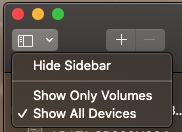
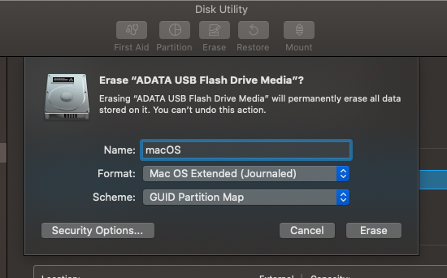
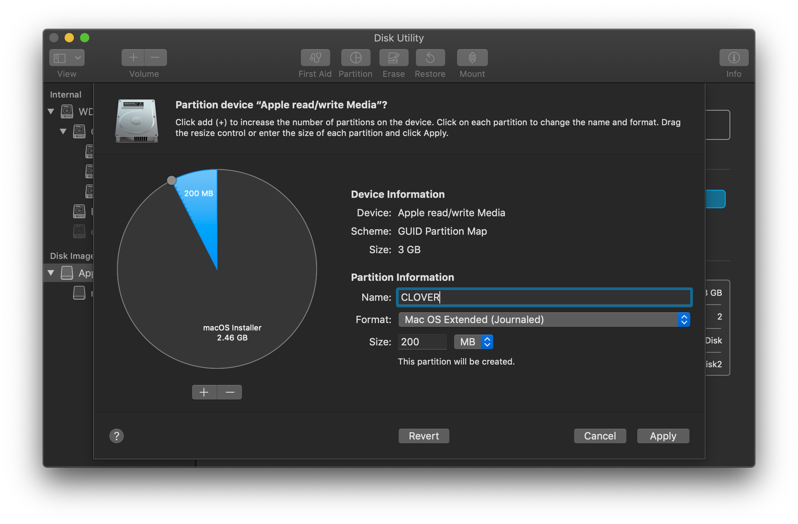

# Preparing the USB Media

## Prepare macOS for Installation

For this step, you'll need a USB thumb drive that's 16GB or larger, and if possible it should be USB 2.0. Plug the stick into another Mac before continuing. This procedure will erase the USB drive, so save any files to another location before proceeding.


This method assumes you are using a **Mac** or a **macOS environment system**, and your target system uses UEFI. If you are using Windows or Linux, review the [Preparing your Installer Media section](https://internet-install.gitbook.io/macos-internet-install/preparing-your-installer.../preparing-your-installer-media...) of the Vanilla Internet install guide instead.


### Create the Target Partition

To start, we need to prepare the target partitions where CLOVER \(the boot manager, down bellow\) and macOS Installer will be copied to.

* Plug the USB stick into your computer, and open **Disk Utility**.
* In Disk Utility, select **View** and then **Show All Devices**.



* Select your Thumb Drive, and then Erase.
* Erase the drive using a **macOS Extended** partition, and **GUID partition map**.



* Once the drive is formatted, select it again followed by Partition.
* Click the `+` symbol to add a partition, and create the following additional partition.
  * Name: CLOVER
  * Format: MS-DOS \(FAT\)
  * Size: 200 MB 



The EFI partition should be mounted automatically once formatted.

## Preparing macOS for Installation

To prepare our USB media, we'll use a tool called gibMacOS written by CorpNewt. This tool will download macOS installation files that we'll use to write to our USB stick. Start by downloading the software.

[Download gibMacOs @ Github](https://github.com/corpnewt/gibMacOS)

Once it's downloaded, extract it and run the **gibMacOS.command** to download the installation media. Use the `-v` command to _specify the version of macOS_ we're downloading. For our example, we'll download Mojave 10.14.6.

```text
$ ./gibMacOS.command -v 10.14.6
```

The process will take a while to complete, when it finishes the macOS installation files can be found in the `gibMacOS/macOS Downloads/publicrelease` directory. Now that it's downloaded, we can build the application using a script that's included with gibMacOS. To do this, we'll run the script and then drag the folder containing the installation media into the terminal window.

```text
$ ./BuildmacOSInstallApp.command
```

Press enter in the terminal window after dragging and dropping the installation folder, and the script will build the application that we'll use to write our media files to the USB stick. Once that process completes, find the "Install macOS {MacOS Version}.app" in the same folder and drag it to Applications. Next verify the name of your USB volume and use the createinstallmedia command to write the installation files to the USB stick. Be sure of the volume path before continuing. If you're using a macOS different than the example update the Install macOS Mojave.app reference to the version of macOS that you're creating the media for.

```text
$ sudo /Applications/Install\ macOS\ Mojave.app/Contents/Resources/createinstallmedia --volume /Volumes/{USB VOLUME}
```

Press yes to overwrite the volume, and the utility should format and write the installation files to the stick.

## Installing CLOVER

Installing Clover is a relatively simple process, and most guides recommend using the Clover installer. We're going to instead walk down the manual path of installing Clover to your EFI. This process works for thumb drives and for installation onto your SSD/HDD and it will prepare your EFI for changes made in subsequent sections.

First thing first, you should download the latest Clover from the Clover Build Repository. Be sure to download the .tar.lzma package.

[Download Clover @ CBR](https://cloverdb.com)

Now that you have the .tar.lzma package, extract it with The Unarchiver or your archive tool of choice. Mount the extracted ISO image by double clicking it.

## Create the CLOVER Structure

The tree view below describes the typical layout of a CLOVER UEFI installation. Use the CLOVER iso image to create this structure within your EFI partition by making directories and copying files from the ISO. Do not add anything more than what's listed in the tree view below for now.

```text
EFI
├── BOOT
│   └── BOOTX64.efi
└── CLOVER
    ├── ACPI
    │   ├── origin
    │   └── patched
    ├── CLOVERX64.efi
    ├── drivers
    │   └── UEFI
    │       ├── HFSPlus.efi
    │       └── FSInject.efi
    ├── kexts
    │   └── Other
    ├── themes
    └── tools (optional)
        ├── Shell32.efi
        ├── Shell64.efi
        ├── Shell64U.efi
        └── bdmesg.efi
```

Now you're ready for the rest of the guide. **Don't try and boot CLOVER yet**. The structure is in place, but it is missing many components required for booting.

That's it!

