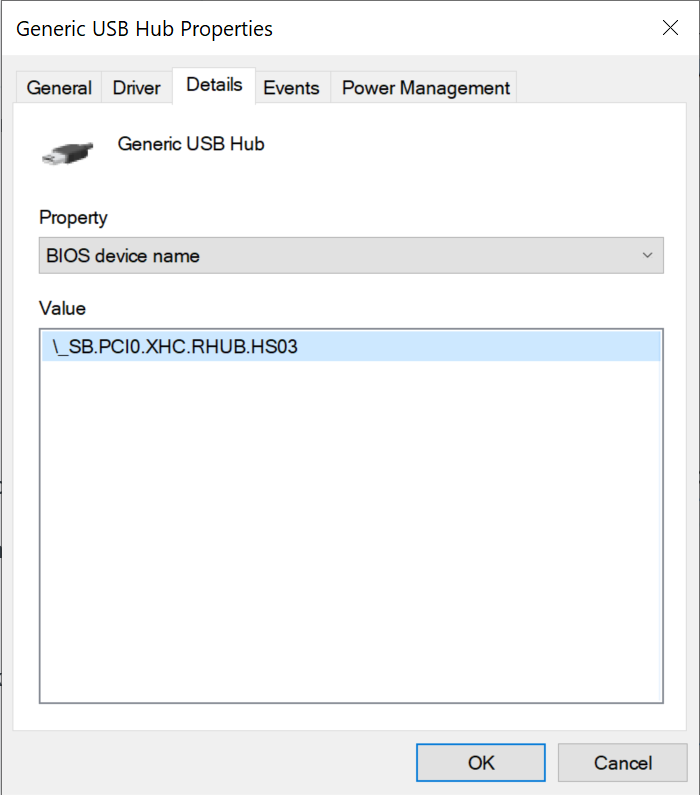

# USB pre-setup

USB ports and controllers on macOS are one of the most tricky parts of a hackintosh. Ever since 10.11, Apple decided to change the way macOS handles the ports and controllers and how many can it handle, which would limit the number of ports. You can know more about that here:

[USB Map by CorpNewt @ Gitbook](https://usb-map.gitbook.io/project/)

[10.11+ USB changes and solutions by Rehabman @ tonymacx86 forums](https://www.tonymacx86.com/threads/guide-10-11-usb-changes-and-solutions.173616/)

In this part of the guide, we will see how to temporary fix your USB drives for the installer section.


This is only a **TEMPORARY** fix, do **NOT** keep it as permanent solution.


### Getting USBInjectAll

This driver would enumerate all the USB ports available in your system \(following the ACPI tables\) and inject **all** of them to macOS, this would let macOS see \*most\* of the ports. The reason why it wouldn't see all of them is because of the Port Limit. However we're going to use USBInjectAll to limit some ports when we need it.

[USBInjectAll Project - Rehabman @ BitBucket](https://bitbucket.org/RehabMan/os-x-usb-inject-all/downloads/)

### For USB2.0 flash drives

You do not need anything more to do, you can just plug and use it for the installer, make sure you get USBInjectAll.

In case you have an Ivy Bridge up to Broadwell laptop, make sure that `change EHC1 to EH01` and `change EHC2 to EH02` ACPI patches are **disabled**. If you have a USB3.0 port, plug the drive in it.

### For USB3.0 flash drives

USBInjectAll would inject all the USB ports detected beginning with USB2.0 personalities. And since most controllers support at least 11 USB2.0 personalities, it would fill up the maximum allowed ports by macOS \(check the CorpNewt guide above to understand more about that\). To fix this, we can try and limit some ports from showing up to keep room for USB3.0 personalities to show up \(since 1 USB3.0 personality = 2 ports count, and 1 USB2.0 personality = 1 port count\).

#### Solution \#1

Use a USB2.0 drive and see the above section.

#### Solution \#2

Use a USB2.0 hub or extension cord to force the USB3.0 drive to run in USB2.0 mode.

#### Solution \#3

On Windows, plug your USB3.0 drive in a USB3.0 port. In case you have a Skylake \(6th Gen intel\) platform, you have only one controller \(XHCI, for USB3.0\), if you have Broadwell or earlier, you have two controllers \(XHCI, USB3.0, and EHCI, USB2.0\), either way use the USB3.0 port of your device. Right click on Start &gt; Device Manager, highlight "_USB Root Hub \(USB3.0\)_" or "_Intel\(R\) USB 3.0 eXtensible Host Controller_" under "Universal Serial Bus Controller" section:


Then select View &gt; Devices by connection


Your setup should look something similar to this, 


Under `USB Root Hub` you'll see your connected USB devices \(USB3.0 ports, in this case even my internal USB devices since I only have an XHCI controller, for Broadwell and earlier you may find the internal USB devices under EHCI, we do not need to care about those\). You should see your USB drive under this section, OR under a USB Hub, either way look for the root device under `USB Root Hub` that leads to your USB3.0 drive \(it can also be the USB3.0 drive itself\).

Select your drive and double click on it, or right click &gt; Properties, in this example, I'll select "Generic USB Hub":


Go to Details &gt; and choose under Property list: "BIOS device name"



Here, we can see where the BIOS/UEFI's ACPI has defined the port location and **Name**. In this case it's named `HS03`, for USB3.0 devices it should be named **SSxx** \(in some cases it's named SSPx, usually it's SSxx\). In case it's named `HSxx` you can just go and start your macOS installer, if it's named `SSxx` make sure to check if you have a USB keybaord and do the same process as above and make sure you remember its name, usually it's connected to a USB2.0 personality in the XHCI controller, so it's going to be named as HSxx instead of SSxx.


At this point, if you have a **USB attached Mouse/Trackpad** \(some laptops have it connected through PS2 like seen in the section before\), do the same process as above and make sure you remember its name, usually it's connected to a USB2.0 personality in the XHCI controller, so it's going to be named as `HSxx` instead of  `SSxx`.



If you happen to use a Bluetooth mouse, it's better if you change it for a USB one, Bluetooth on macOS is quite a hassle also it's not going to work properly in the installer environment.


Now go back to your config.plist &gt; Boot &gt; Arguments. Here you're going to add these arguments:

```text
-uia_exclude_hs uia_include=HSxx,SSxx
```

#### Explanations:

* `-uia_exclude_hs` is a boot argument read by USBInjectAll driver that would tell it to disable the enumeration and injection of all HS \(USB2.0\) personalities, leaving some sports for the SS \(USB3.0\) personalities to be injected \(lifting the 15 ports limit by removing some ports\).
* `uia_include:HSxx,SSxx` is a boot argument read by USBInjectAll driver that would **include** some excluded ports and with that we can include USB mice/keyboards that we got the IDs of before. There is no need to include any `SS` device, since they're all included anyways. So your argument will look something like this: `uia_include=HS03,HS05` \(if, for example, your USB devices that you want to keep and are USB2.0 devices named HS03 and HS05\).

Save your config.plist. With this you can continue the setup and review your Installation files.

